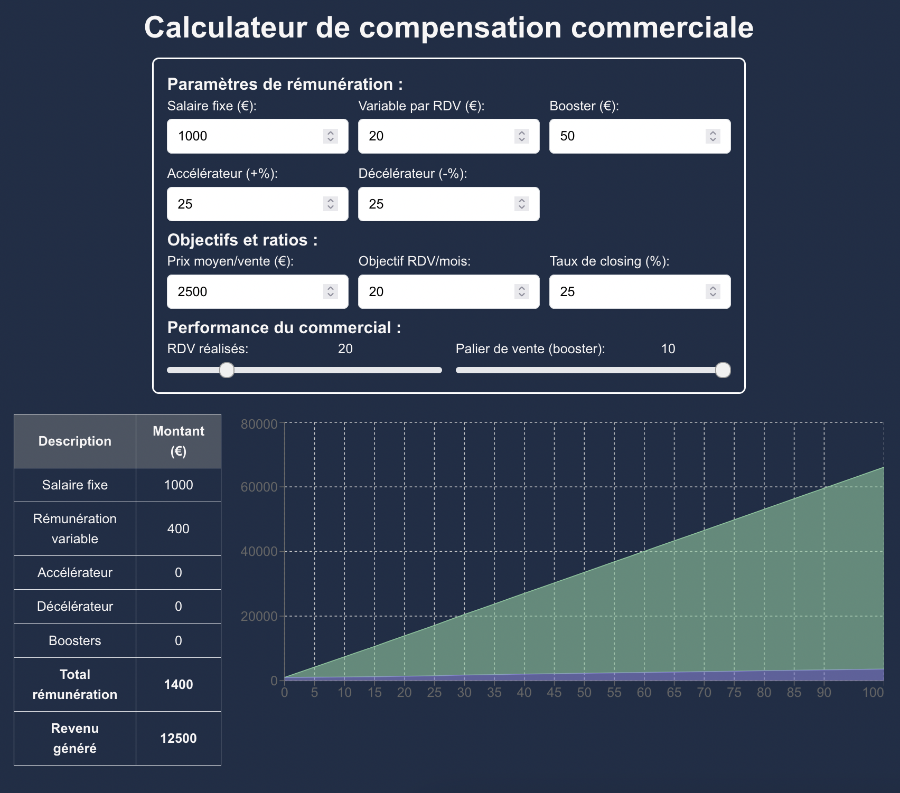

# Calculateur de Compensation Commercial

Ce projet est une application web créée à l'aide de **NextJs**, **React**, **TypeScript**, et **Tailwind CSS** pour permettre aux commerciaux de calculer et visualiser leur rémunération en fonction de leurs performances.

## Fonctionnalités

L'application permet aux utilisateurs d'entrer des paramètres de rémunération tels que le salaire fixe, la rémunération variable, les boosters, et les accélérateurs/décelérateurs.
Ensuite, ils peuvent ajuster les performances à l'aide de sliders pour voir comment ces performances affectent la rémunération totale.
Enfin, ils peuvent visualiser leur resultats dans un tableau et un graphe. 




## Installation

First, git clone the project.

then, run command:

```bash
npm run dev
# or
yarn dev
# or
pnpm dev
# or
bun dev
```

Open [http://localhost:3000](http://localhost:3000) with your browser to see the result.


## Deploiement sur Vercel

https://calculateur-comp.vercel.app/
